<div align="center">

# 🚗 DVLD — Driving License Management System (Enterprise Simulation)


A full-featured **desktop application** for managing driving licenses, built with **C# WinForms**, **SQL Server**, and a clean **3-Tier Architecture**.

👨‍💻 **Author:** Marnissi Ahmed Mustapha
📅 **Last Updated:** May 2026

</div>

---

## ⚡ TL;DR

A real-world **Driving License Management System** that handles the full lifecycle of licenses
—from application and testing to issuance, renewal, detention, and international licensing—
with **complex business rules, role-based access control, and enterprise-like architecture**.

👉 Designed as a **complete system**, not just a CRUD application.

---

## 💡 Key Highlights

* Full licence lifecycle (Application → Tests → Issuance → Renewal)
* Complex business rules enforcement (real-world logic)
* Role-based authentication & authorization
* Multi-module enterprise-like architecture
* Advanced desktop UI with rich interactions
* Audit tracking for all operations

---

## 📊 System Complexity

* 10+ Modules
* 30+ Screens
* Multi-step workflows
* Real-world constraints & validations
* Full audit tracking

This project goes beyond CRUD into **real system design**.

---

## 📋 Table of Contents

* [Overview](#overview)
* [Architecture](#architecture)
* [Features & Screenshots](#features--screenshots)
* [License Classes](#license-classes)
* [Business Rules](#business-rules)
* [Tech Stack](#tech-stack)
* [Getting Started](#getting-started)
* [What I Learned](#-what-i-learned)

---

## Overview

**DVLD (Driving and Vehicle License Department)** is a comprehensive system that simulates a real-world government authority responsible for managing driving licenses.

It covers the complete lifecycle:

* Applicant registration
* License application
* Multi-stage testing
* License issuance
* Renewal & replacement
* Detention handling
* International licensing

---

## Architecture

The project follows a strict **3-Tier Architecture**:

```
Presentation Layer (WinForms UI)
        ↓
Business Logic Layer (DVLDBusinessLayer)
        ↓
Data Access Layer (ADO.NET)
        ↓
SQL Server Database
```

✔️ Separation of concerns
✔️ Maintainability
✔️ Scalability

---

## Features & Screenshots

### 🔐 Authentication

| Login                              | Account Settings                                     |
| ---------------------------------- | ---------------------------------------------------- |
| 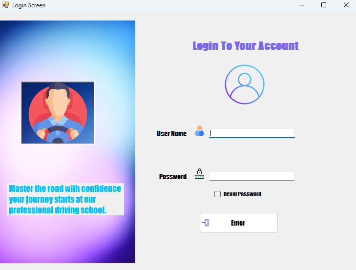 | 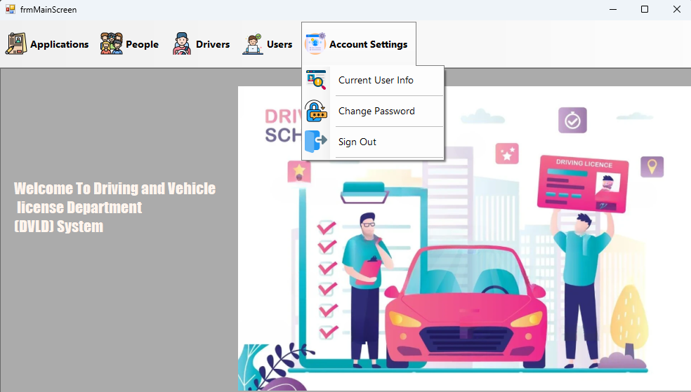 |

---

### 👥 People Management

| Manage People                               | Edit Person                               |
| ------------------------------------------- | ----------------------------------------- |
| 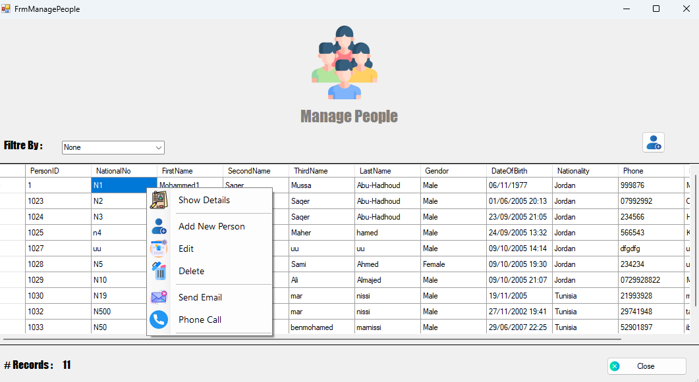 | 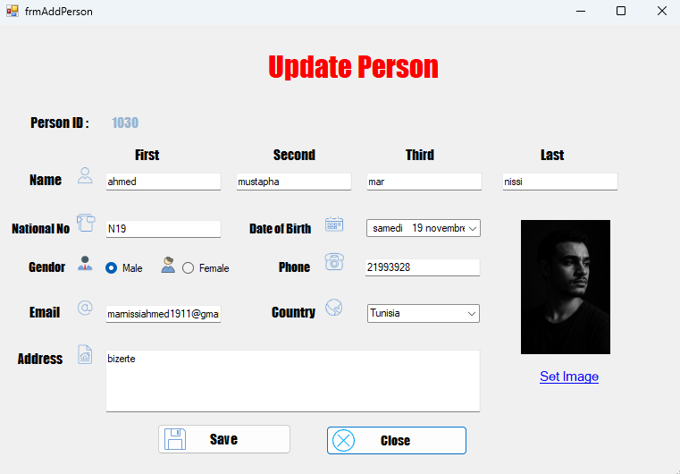 |

---

### 🧑‍💼 User Management

| Users                                            | Add User                                          |
| ------------------------------------------------ | ------------------------------------------------- |
| 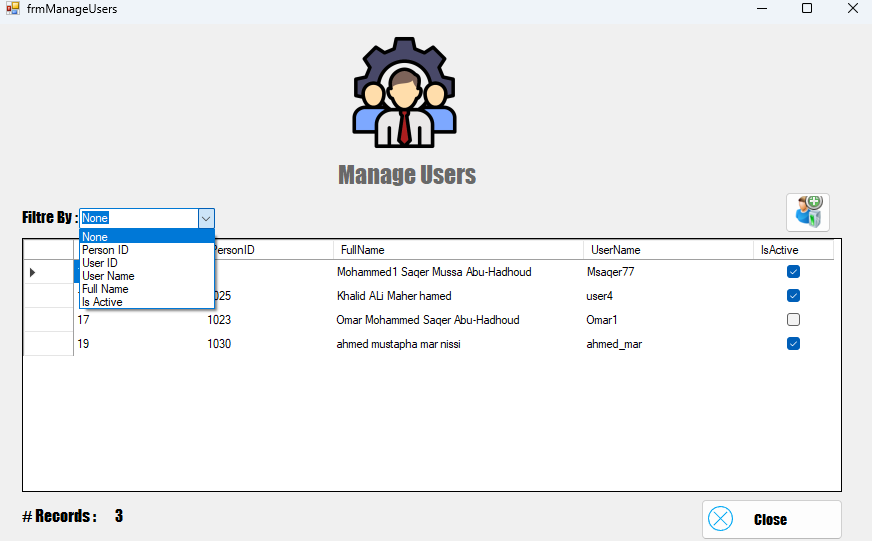 | 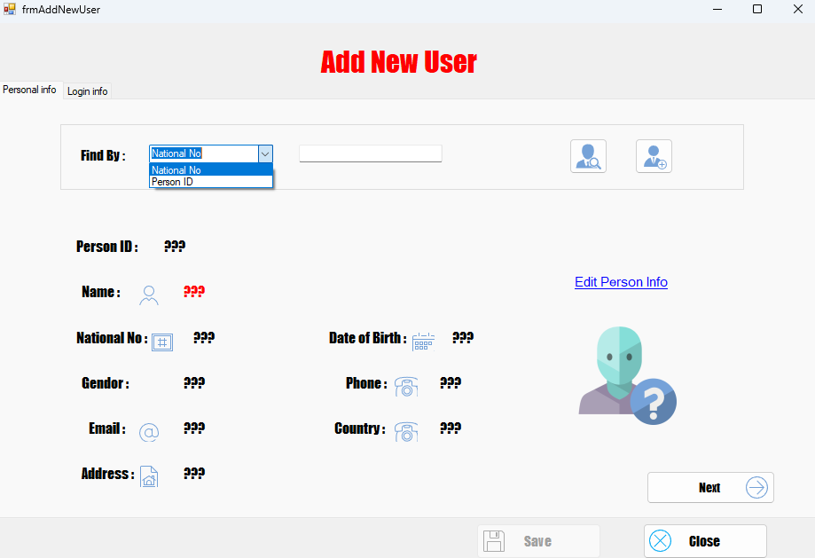 |

---

### 🚘 Driver Management

| Drivers                                       | License History                                       |
| --------------------------------------------- | ----------------------------------------------------- |
| 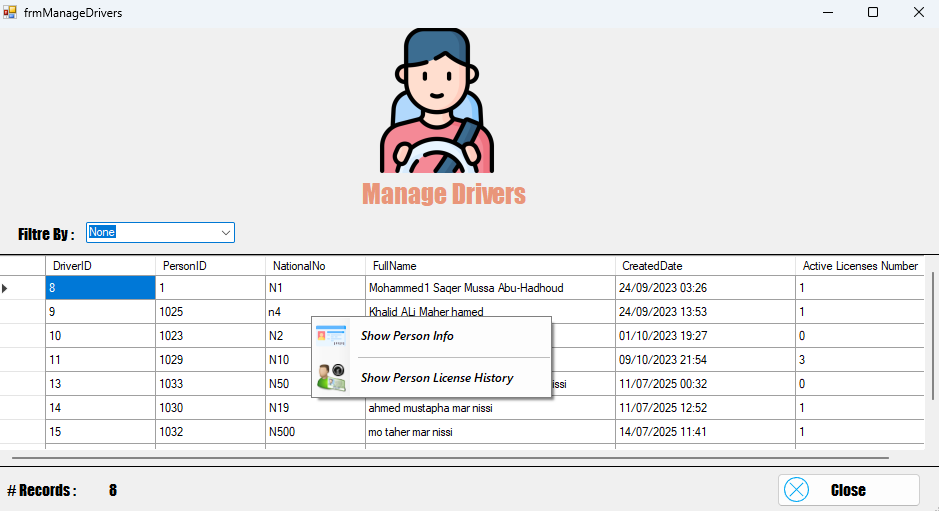 | 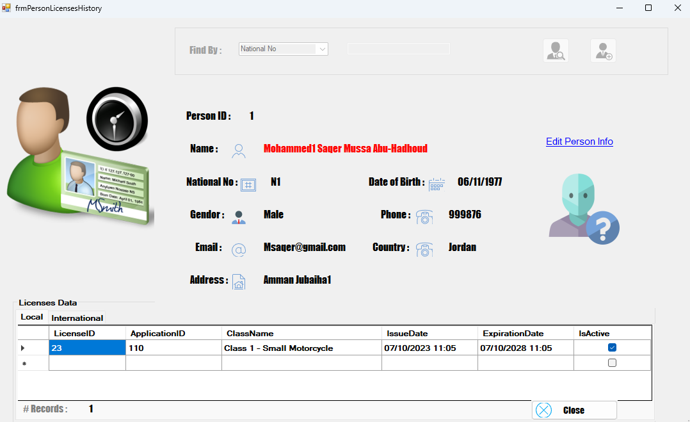 |

---

### 📄 License Applications

* New Local / International License
* Renewal
* Replacement
* Detention & Release
* Retake Test

| Applications                                                | Schedule Tests                                   |
| ----------------------------------------------------------- | ------------------------------------------------ |
| 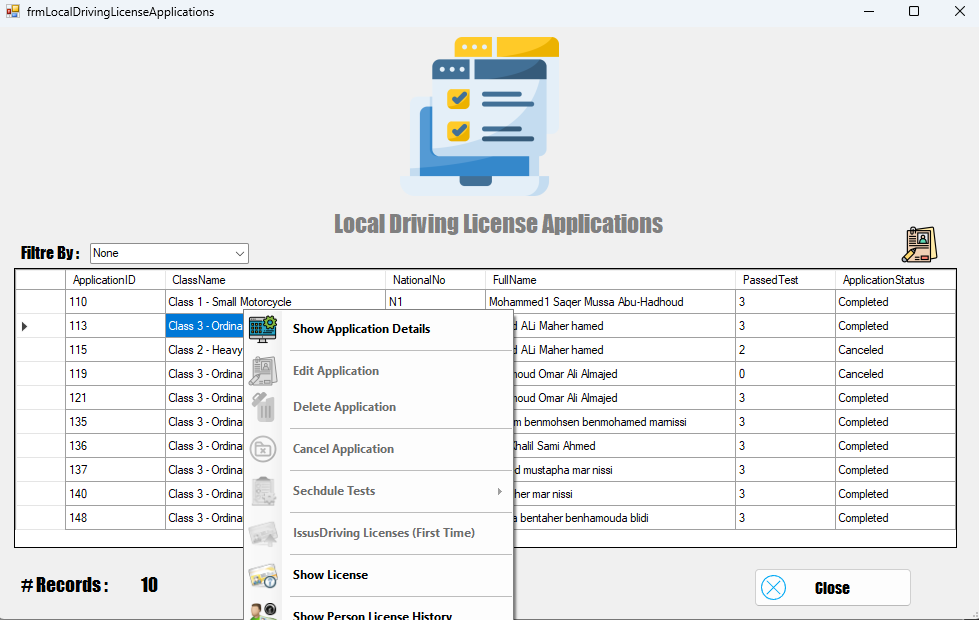 | 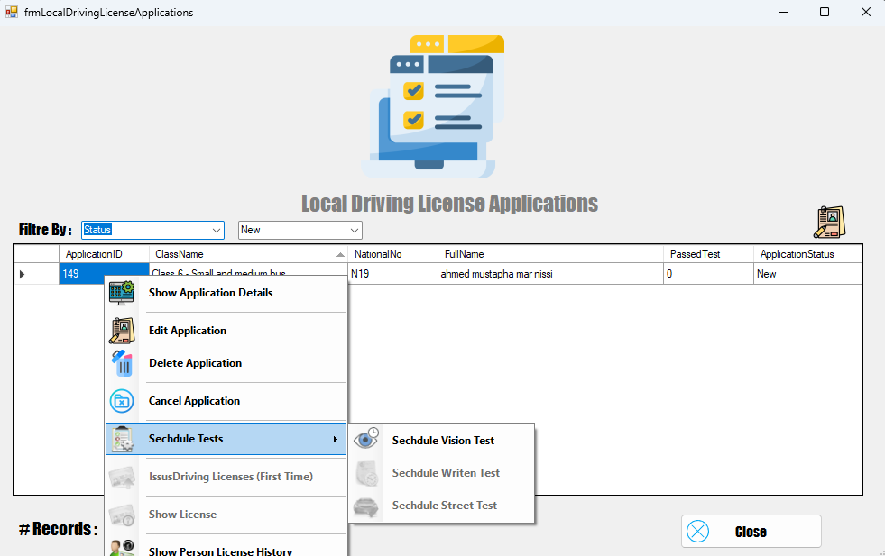 |

---

### 🧪 Test System

* Vision 👁️
* Written 📝
* Street 🚗

✔️ Sequential enforcement
✔️ Retake logic

---

### 🪪 License Issuance

| Issue License                                          | License Info                                    |
| ------------------------------------------------------ | ----------------------------------------------- |
| 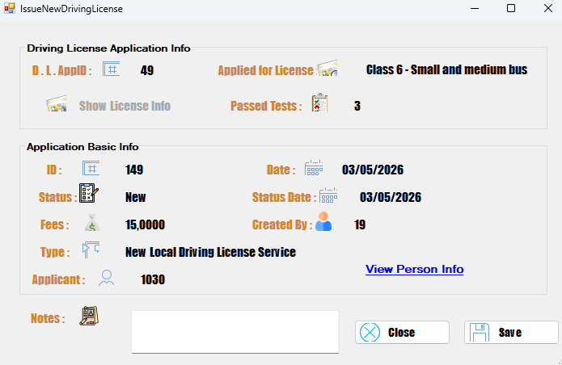 | 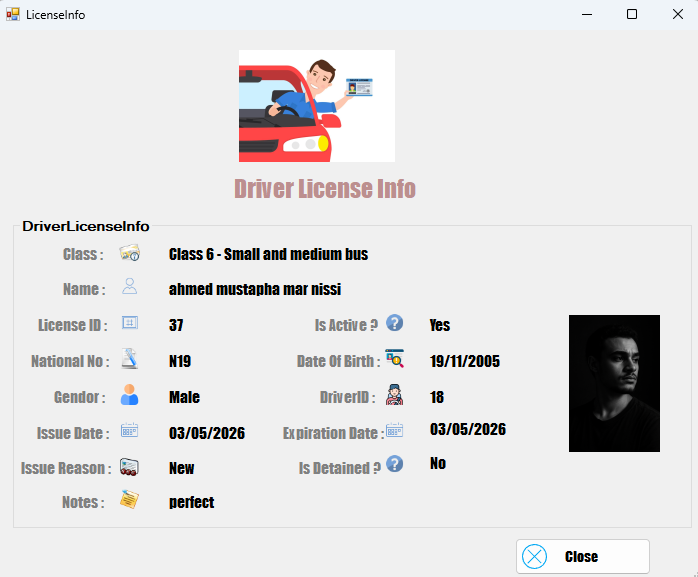 |

---

### 🌍 International Licenses

| Applications                                                       | Issue                                                         |
| ------------------------------------------------------------------ | ------------------------------------------------------------- |
| 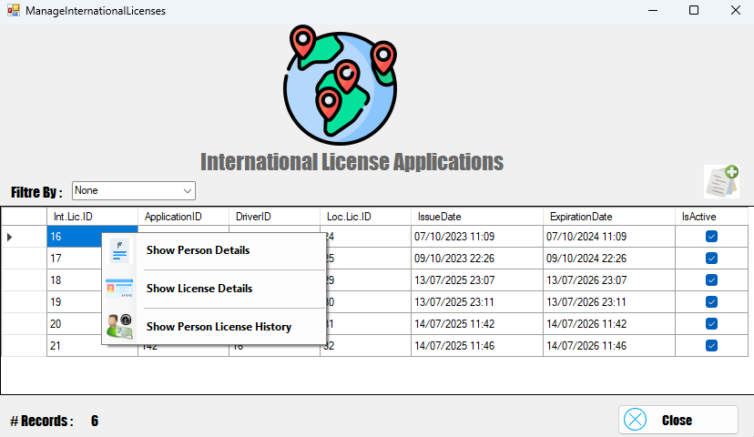 | 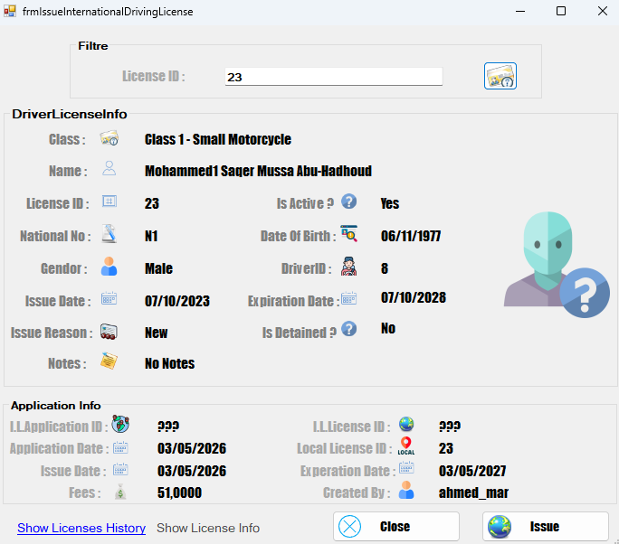 |

---

### 🚫 Detained Licenses

| List                                                   | Release                                                      |
| ------------------------------------------------------ | ------------------------------------------------------------ |
| 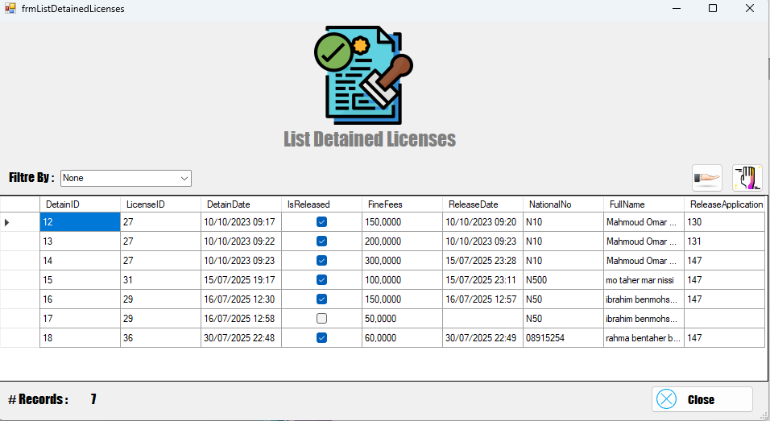 | 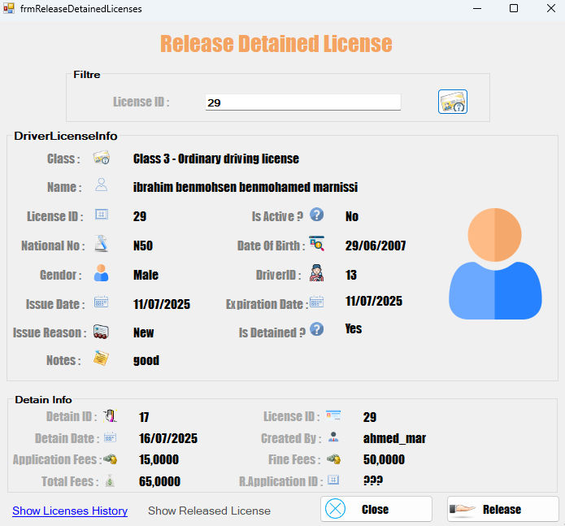 |

---

### ⚙️ System Administration

| Application Types                                     | Test Types                                     |
| ----------------------------------------------------- | ---------------------------------------------- |
| 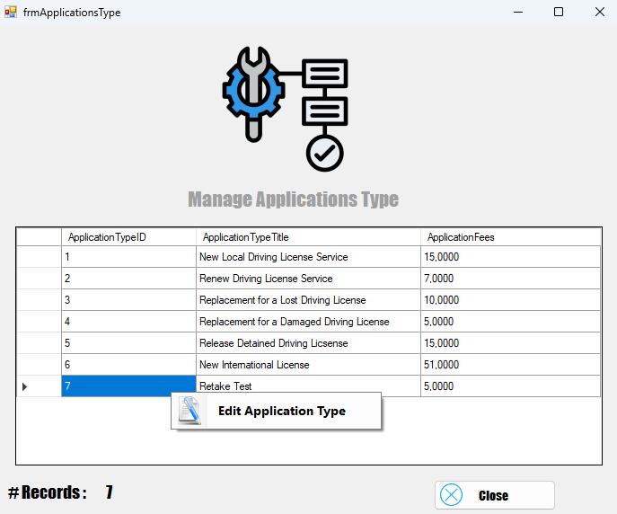 | 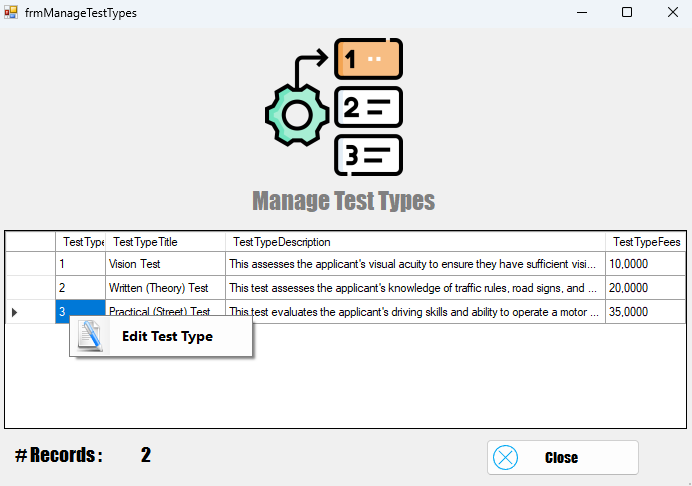 |

---

## License Classes

| Class   | Description              |
| ------- | ------------------------ |
| Class 1 | Small Motorcycle         |
| Class 2 | Heavy Motorcycle         |
| Class 3 | Ordinary Driving License |
| Class 4 | Commercial               |
| Class 5 | Agricultural             |
| Class 6 | Small and Medium Bus     |
| Class 7 | Truck and Heavy Vehicle  |

---

## Business Rules

* Tests must follow sequence: Vision → Written → Street
* License issued only after passing all tests
* Cannot apply twice for same license class
* Detained licenses cannot be used
* International license requires active local license
* Full audit tracking per user

---

## Tech Stack

| Layer        | Technology          |
| ------------ | ------------------- |
| Language     | C# (.NET Framework) |
| UI           | WinForms            |
| Architecture | 3-Tier              |
| Database     | SQL Server          |
| Data Access  | ADO.NET             |

---

## Getting Started

### Prerequisites

* Windows OS
* Visual Studio
* SQL Server

### Setup

```bash
git clone https://github.com/ahmedmustaphamarnissi/Driving-licence-managment.git
```

1. Open solution
2. Configure DB
3. Run project

---

## 🧠 What I Learned

* Designing real-world systems
* Implementing complex business rules
* Building scalable desktop apps
* Structuring layered architecture
* Managing large projects

---

<div align="center">

Built with ❤️ in Tunisia 🇹🇳

</div>
